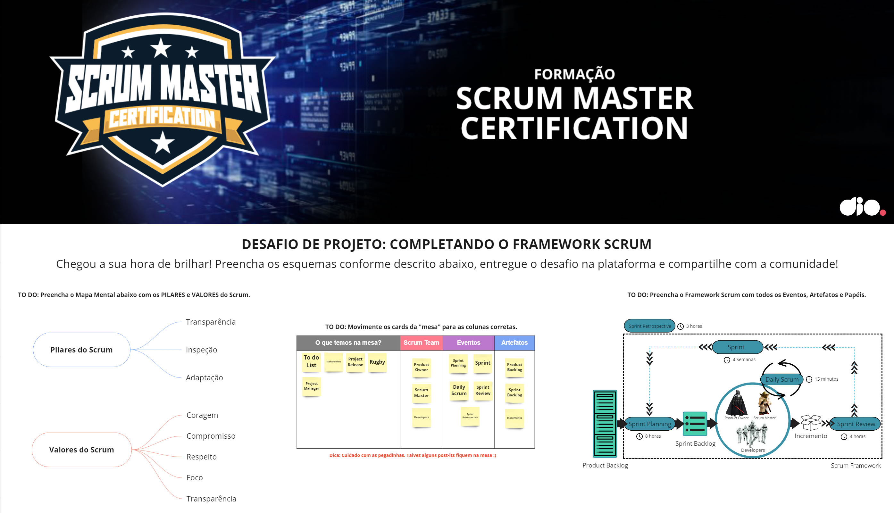

# **Entendendo o Desafio**

Neste Desafio você assumirá o protagonismo e terá que completar o **Framework Scrum**. Ao final da jornada, você terá um material rico para estudo e compartilhamento com a comunidade. Sendo assim, os seus objetivos neste Desafio de Projeto serão: **fixar os pilares e valores do Scrum, bem como reforçar os aspectos fundamentais do Framework Scrum: Responsabilidades, Eventos e Artefatos.** 

**Seja criativo(a)! Explore todos os conceitos que aprendemos nessa imersão e replique (ou melhore, porque não) este projeto prático. Para isso, seu próprio repositório e, com isso, aumente ainda mais seu portfólio de projetos no GitHub!**

 
# **Slides**

A apresentação completa utilizada durante o curso está disponível[AQUI](https://academiapme-my.sharepoint.com/:b:/g/personal/kawan_dio_me/EYDUevl0h_RGlyFUZ260bAwBJLSOUO8UIdNLP6dTuIWBvQ?e=kMEMUK)

Com isso, você terá acesso a todos os slides e links explorados durante as aulas

 
# **Links úteis**

Template no Miro: https://miro.com/app/board/uXjVPahls68=/?share_link_id=956189813435 

Download – Scrum Guide: https://scrumguides.org/index.html 

**Bons estudos!**

